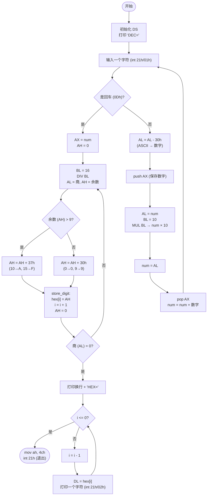

# 5_1.asm 流程图 — 十进制 0-255 → 十六进制

```mermaid
flowchart TD
    start(["开始"]) --> init["初始化 DS<br/>打印 'DEC='"]
    init --> input_char["输入一个字符 (int 21h/01h)"]

    input_char --> is_cr{"是回车 (0Dh)?"}
    is_cr -- 是 --> conv_init["AX = num<br/>AH = 0"]
    is_cr -- 否 --> to_digit["AL = AL - 30h<br/>(ASCII → 数字)"]
    to_digit --> push_digit["push AX (保存数字)"]
    push_digit --> mul10["AL = num<br/>BL = 10<br/>MUL BL → num × 10"]
    mul10 --> save_num["num = AL"]
    save_num --> pop_add["pop AX<br/>num = num + 数字"]
    pop_add --> input_char

    conv_init --> divide["BL = 16<br/>DIV BL<br/>AL = 商, AH = 余数"]
    divide --> cmp_rem{"余数 (AH) &gt; 9?"}
    cmp_rem -- 是 --> hex_A_F["AH = AH + 37h<br/>(10→A, 15→F)"]
    cmp_rem -- 否 --> hex_0_9["AH = AH + 30h<br/>(0→0, 9→9)"]
    hex_A_F --> store
    hex_0_9 --> store["store_digit:<br/>hex[i] = AH<br/>i = i + 1<br/>AH = 0"]
    store --> cmp_quot{"商 (AL) = 0?"}
    cmp_quot -- 否 --> divide
    cmp_quot -- 是 --> print_hex["打印换行 + 'HEX='"]

    print_hex --> output_loop{"i &lt;= 0?"}
    output_loop -- 是 --> exit_prog(["mov ah, 4ch<br/>int 21h (退出)"])
    output_loop -- 否 --> dec_i["i = i - 1"]
    dec_i --> print_digit["DL = hex[i]<br/>打印一个字符 (int 21h/02h)"]
    print_digit --> output_loop
```
